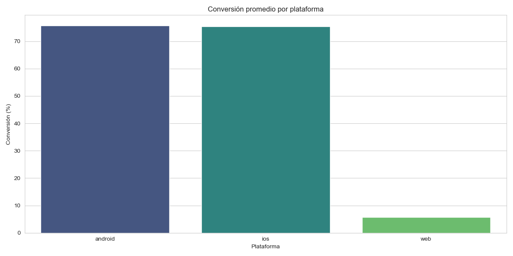
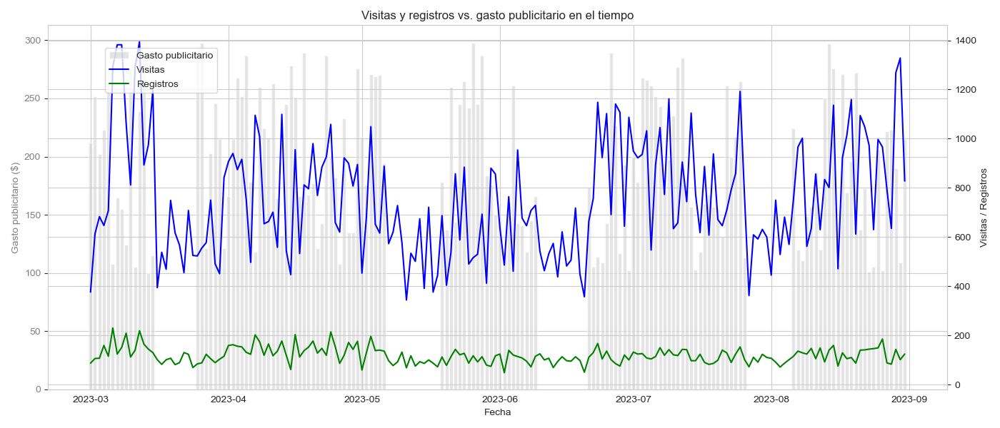

# 📈 Dashboard de conversiones de marketing

[](https://github.com/SilviaPalencia/data-analyst-project-280/actions)

Análisis de visitas, registros y gasto publicitario de un servicio online, con datos obtenidos desde una **API** y archivos externos. Un script en Python automatiza la extracción, limpieza y cálculo de conversiones, y genera las visualizaciones para evaluar el impacto de la publicidad y detectar anomalías en el embudo.

Proyecto de aprendizaje del programa [Analista de Datos de Códica](https://app.codica.la/programs/data-analyst).

## 🛠️ Herramientas

- **Python:** pandas, NumPy, Matplotlib, Seaborn, requests, python-dotenv
- **Jupyter Notebook**
- **API REST** para obtener visitas y registros

## ⚙️ ¿Qué hace el script?

1. **Extrae** visitas y registros desde la API para el período definido en el archivo `.env`.
2. **Limpia** los datos: excluye el tráfico de bots y convierte las fechas.
3. **Agrupa** visitas y registros por día y plataforma (web, Android, iOS) y calcula la tasa de conversión.
4. **Cruza** los resultados con los costos de 5 campañas publicitarias.
5. **Exporta** `conversion.json` y `ads.json` y genera 12 gráficos en la carpeta [`charts/`](charts).

## 📁 Contenido del repositorio

| Archivo | Descripción |
|---|---|
| [`charts_project.ipynb`](charts_project.ipynb) | Notebook con todo el proceso y la presentación de resultados |
| `conversion.json` | Visitas, registros y conversión por día y plataforma |
| `ads.json` | Visitas, registros y gasto publicitario por día y campaña |
| `ads.csv`, `visitas.csv`, `inscripciones.csv` | Datos de origen |
| [`charts/`](charts) | Visualizaciones generadas |

## 📊 Hallazgos principales

Período analizado: **1 de marzo al 1 de septiembre de 2023 (6 meses)**, con **138.703 visitas** y **21.836 registros**.

- **Conversión promedio diaria: 16,5%**, con variaciones entre ~7% y ~28%.
- **Web concentra el 86% de las visitas**, pero convierte solo el 5,8%, mientras que Android e iOS superan el 75%. Vale la pena revisar el proceso de registro en la versión web.
- **Publicidad:** la correlación entre gasto y visitas (0,30) y entre gasto y registros (0,31) es positiva pero débil. Aumentar el presupuesto no garantiza más registros.
- **Caídas de registros sin caída de tráfico** (2 y 20 de junio, 27 de agosto): apuntan a un posible problema técnico en el formulario, no a falta de visitas.




## 💡 Recomendaciones

- Investigar con el equipo técnico las fechas con caídas aisladas de registros.
- Optimizar la conversión, especialmente en web, antes de aumentar el gasto publicitario.
- Mantener las campañas que sostienen un tráfico consistente.

## ▶️ Cómo ejecutarlo

```bash
git clone https://github.com/SilviaPalencia/data-analyst-project-280.git
cd data-analyst-project-280
pip install pandas numpy matplotlib seaborn requests python-dotenv
```

Crea un archivo `.env` con las variables `API_URL`, `DATE_BEGIN` y `DATE_END`, y ejecuta el notebook `charts_project.ipynb`.

## 👩‍💻 Autora

**Silvia Valentina Palencia Carvajal** – Analista de Datos Junior
[LinkedIn](https://www.linkedin.com/in/silviapalencia-datos) · [GitHub](https://github.com/SilviaPalencia)
